# 智能电表数据分析平台

## 背景
本部署指南详细描述了如何在云上使用 AWS CloudFormation 模板部署基于数据湖、人工智能和无服务架构的智能电表数据分析平台，旨在为水电，风电，天然气，光伏发电等公共能源公司和智能仪表公司，提供历史异常电量查询，异常仪表查询，仪表汇聚数据查询和未来电量消耗预测等功能，数据源则来自电表数据管理系统（MDM）或类似系统。

## 解决方案描述
智能电表数据分析平台利用AWS S3，RedShift，Glue等服务构建的数据湖实现对现有MDM系统仪表数据的存储，清洗，汇聚和查询，结合AWS Step Function和AWS SageMaker实现ML模型构建，部署的自动化，通过AWS API Gateway，Lambda构建的无服务架构将数据查询，汇聚，预测等能力通过RESTful API形式提供给客户，为客户提供历史异常电量查询，异常仪表查询，仪表汇聚数据查询和未来电量消耗预测等功能。

## 使用场景
该解决方案旨在帮助希望改善其智能电表投资回报率的能源和仪表行业客户，从而提供替代其原有MDMS（电表数据管理解决方案）。传统的MDMS系统已经使用了15年以上，并且大多数仅有帐单核对的功能，通过AWS数据湖，AI和无服务架构可为客户深度挖掘数据价值，创造更多增值场景。

## 系统架构
### 架构图
该解决方案可在由西云数据运营的AWS（宁夏）区域或由光环新网运营的AWS（北京）区域中部署。
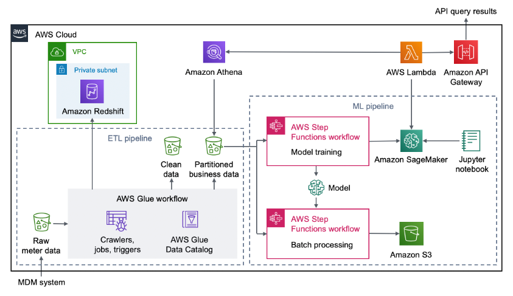

### 部署服务
该解决方案将自动部署以下服务：
- 依据AWS最佳实践，新建或者复用配置有私有子网的虚拟私有云（VPC）
- 私有子网中的AWS Redshift集群，用于存储业务数据以进行分析，可视化和前端展示。
- 数据的提取，转换和加载（ETL）流程，包括：

-- Amazon Simple Storage Service（Amazon S3），用于存储来自MDM或类似系统的注入数据，其中原始仪表数据，清洗数据和分区的业务数据分别存储在独立的S3桶中。

-- AWS Glue工作流，包括爬虫程序，任务程序和事件触发，用于对传入的原始仪表数据进行爬取并转换为所需格式的干净数据和分区的业务数据。

- AWS Glue数据目录，用于存储有关仪表数据的元数据和源信息。
- 机器学习服务：

-- 两个AWS Step Functions工作流，包括1）模型训练，使用分区的业务数据来构建ML模型；2）批处理，使用分区的业务数据和模型中的数据作为预测基础。

-- Amazon S3，用于存储处理后的数据。

-- Amazon SageMaker，用于实时预测能耗。

-- 有示例代码的Jupyter笔记本，用于执行数据分析和数据可视化。

- AWS Lambda通过AWS Athena查询分区的业务数据或调用SageMaker部署的服务节点，对外通过RESTful API的形式提供查询结果。
- AWS API Gateway提供历史异常电量查询，异常仪表查询，仪表汇聚数据查询和未来电量消耗预测等功能。

## 部署说明
### 部署前提
- 确保您的数据已在MDMS（仪表数据管理系统）收集完毕
- 确保您的账户有足够的配额来创建以下资源：

| AWS服务 | 该方案使用配额 | 
| ------------ | ------------ |
| VPCs | 1 | 
| AWS Identity and Access Management (IAM) roles | 7 |  
| Amazon S3 buckets | 6 | 
| AWS Glue crawlers | 4 | 
| AWS Glue jobs | 3 | 
| Amazon SageMaker notebook instances | 1 | 
| Amazon SageMaker endpoints | 1 | 
| AWS Lambda functions | 9 | 
| Amazon API Gateway endpoints | 1 | 
| Amazon Redshift instances | 1 | 
| AWS Step Functions state machines | 3 | 

- 针对该解决方案所创建的AWS Redshift集群，默认我们会给您新建一个VPC来进行部署，如果您选择您已有的VPC，确保准备好对应的网络配置比如CIDR。

## 快速部署

### 启动AWS CloudFormation堆栈
点击宁夏和北京区域链接，打开AWS管理控制台（如果还没登录会先跳转到登录页面，登录后进入模板启动页面）。默认情况下，此模板在宁夏区域启动，您同时可以使用控制台右上方的区域选择链接，以在其他区域部署该方案。然后单击下面链接以启动 AWS CloudFormation 模板。

[宁夏区域](https://cn-northwest-1.console.amazonaws.cn/cloudformation/home?region=cn-northwest-1#/stacks/create/template?stackName=UtilityPlatform&templateURL=https://aws-cn-quickstart-cn-northwest-1.s3.cn-northwest-1.amazonaws.com.cn/quickstart-aws-utility-meter-data-analytics-platform-cn/templates/main.template.yaml "宁夏区域")

[北京区域](https://cn-north-1.console.amazonaws.cn/cloudformation/home?region=cn-north-1#/stacks/create/template?stackName=UtilityPlatform&templateURL=https://aws-cn-quickstart-cn-north-1.s3.cn-north-1.amazonaws.com.cn/quickstart-aws-utility-meter-data-analytics-platform-cn/templates/main.template.yaml "北京区域")

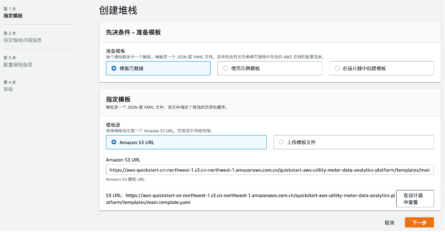

### 指定堆栈细节
在此您需要填入需要创建的AWS RedShift集群的用户名，密码，指定VPC网络的可用区，其他配置采用默认值即可，之后点击【下一步】到堆栈选项。

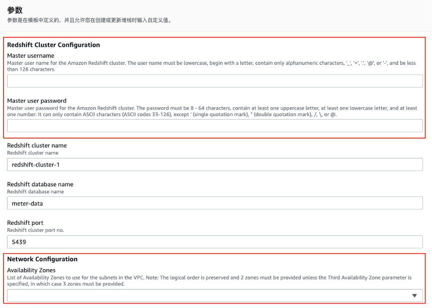

如果您选择在北京（cn-north-1）部署，请将下列配置成对应的cn-north-1。


### 登录到您的账户
使用具有必需权限的IAM用户角色，通过https://console.amazonaws.cn/登录到您的AWS账户。

### 配置堆栈选项
该步骤按照默认值并点击【下一步】进入审核。

### 审核
勾选如下复选框，然后点击【创建堆栈】。
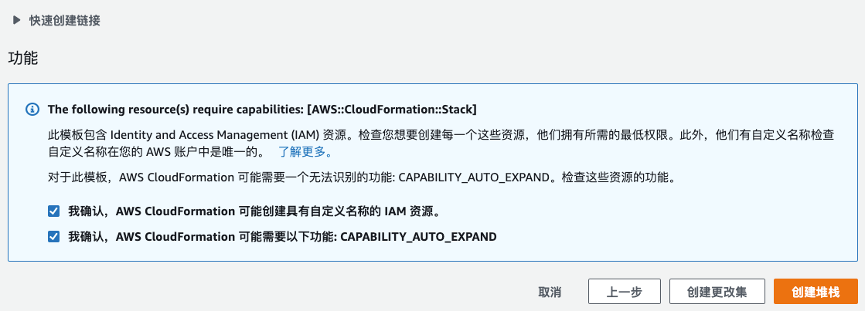

等待约30 分钟，堆栈创建完成后您可以看到父堆栈和嵌套堆栈的创建状态，点击【输出】标签栏您将看到创建的资源细节。

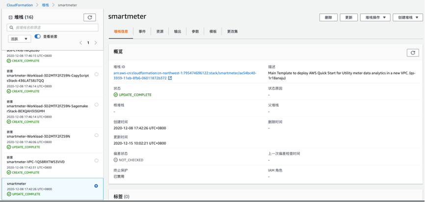

## 安全性
See [CONTRIBUTING](CONTRIBUTING.md#security-issue-notifications) for more information.

## 开始使用
### 下载电表能耗数据集
从[SmartMeter Energy Consumption Data in London Households](https://data.london.gov.uk/dataset/smartmeter-energy-use-data-in-london-households "SmartMeter Energy Consumption Data in London Households")下载适用该方案的数据集，注意该数据集总大小为10G左右，包括1.67亿条智能电表数据，其中提供了单体csv文件（10G左右）和168个较小的csv文件（每个文件66M左右）下载的选项，如果您希望简单试用，建议下载较小的csv文件，在接下来的步骤挑选部分数据集上传。

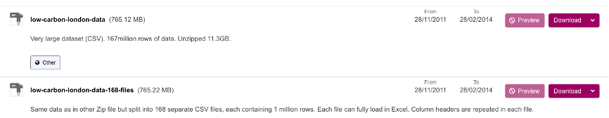

### 将数据集上传至S3桶
进入S3服务界面，点击搜索landingzone关键字，以选取之前创建的S3桶。

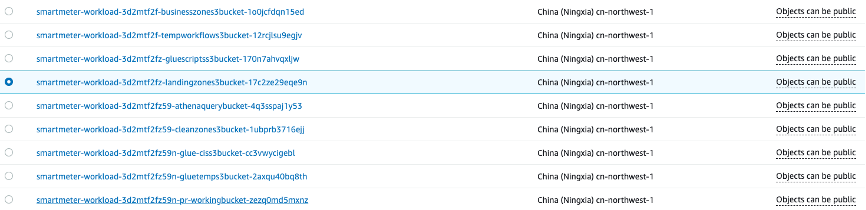

将之前下载的csv文件解压上传。

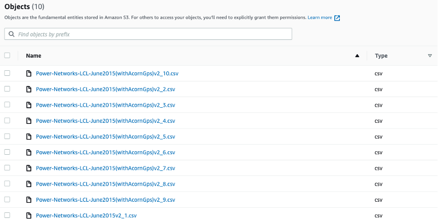

### 增加天气数据集（可选，默认不添加）
从[这里](https://www.kaggle.com/jeanmidev/smart-meters-in-london?select=weather_hourly_darksky.csv "这里")下载使用该方案的天气数据，创建对应的AWS S3桶（如smartmeter-bj-weather-data）并上传，然后登陆到AWS Athena界面，在新查询标签栏下添加如下SQL语句以创建天气相关的AWS Glue表项。

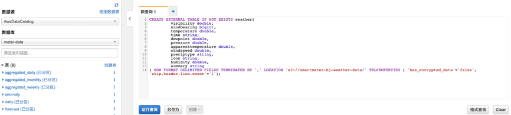
直接将下述SQL语句（斜体标示）拷贝粘贴，注意替换其中字段**smartmeter-bj-weather-data**为您为天气数据创建的S3桶名称
```sql
CREATE EXTERNAL TABLE IF NOT EXISTS weather (
         visibility double,
         windbearing bigint,
         temperature double,
         time string,
         dewpoint double,
         pressure double,
         apparenttemperature double,
         windspeed double,
         preciptype string,
         icon string,
         humidity double,
         summary string 
) ROW FORMAT DELIMITED FIELDS TERMINATED BY ',' LOCATION 's3://smartmeter-bj-weather-data/' TBLPROPERTIES ( 'has_encrypted_data'='false', 'skip.header.line.count'='1');
```

### 触发AWS Step Function工作流

数据准备完毕之后，登陆AWS Glue界面，打开工作流程选项，选择模版创建好的工作流程，点选运行触发后续的数据ETL清洗流程。

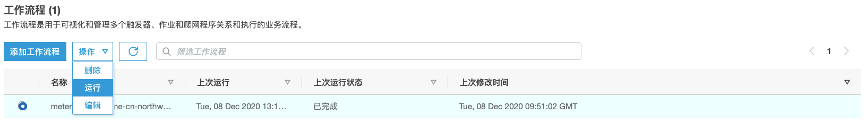

点击【运行】后勾选历史记录选择对应的执行任务，然后点选“查看运行详细信息“可以查看对应工作流程的执行状态。

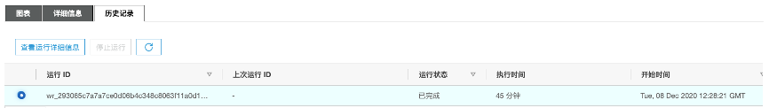

工作流程执行状态显示如下

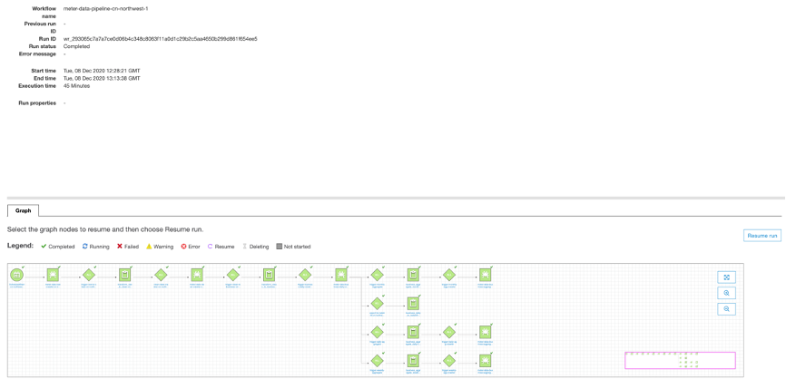

待任务完成之后您可以回到AWS Glue主界面，查看对应的表项是否已经创建完成。

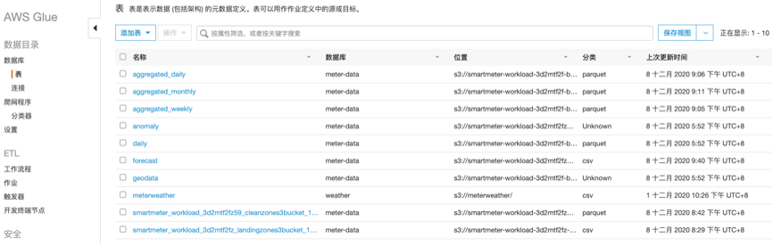

### 查看已训练模型

数据经由AWS Glue清洗，分区之后会自动触发Step Function工作流创建对应的SageMaker实例，模型和用于推理的终端节点。登陆SageMaker界面，利用创建好的SageMaker实例，您可以登陆进实例利用Jupyter开始调用里面预制好的功能，如历史异常电量查询，异常仪表查询，仪表汇聚数据查询和未来电量消耗预测等功能。


记录到终端节点的名称（如ml-endpoint-f2f2a4e3-8dec-4444-8d53-e0eca6a1da1f）在后续RESTFul API的调用中您将用做请求参数。

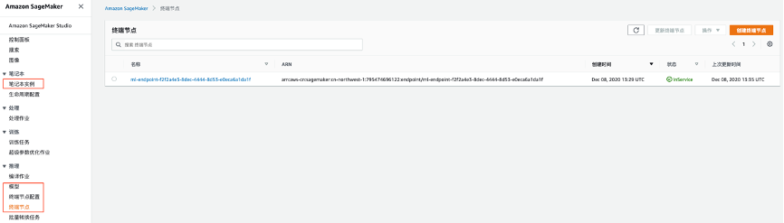

### 重新训练模型（可选）
该方案创建了模型部署的自动化流程，包括模型训练工作流和批处理工作流，ETL处理完毕后的数据将成为模型训练的数据集和训练集。每当有新的数据添加进S3桶（landingzone）后，您可以重新运行整个AWS CloudFormation以重新处理数据集并进行模型的重新训练，您也可以按照不同时间频率（每天/每周/每月）分别运行每个AWS Step Function工作流，以下是具体步骤：

**手动触发AWS Step Function工作流**
数据ETL完毕之后，登陆进AWS Step Function界面，触发流程进行接下来的模型训练，部署和更新。
点选包含PredictionPipelineStateMachine的状态机，点击【启动执行】

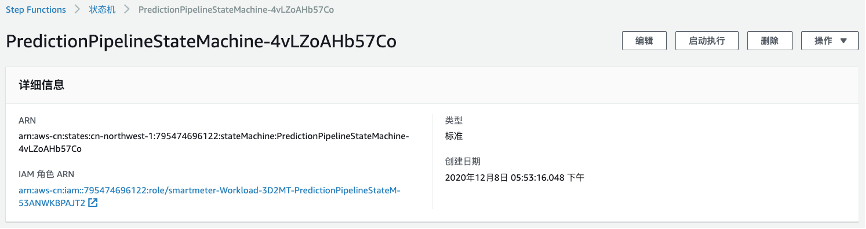

在弹出的对话框中输入如下参数，利用该参数来定义数据的批处理分区大小，预测的周期时长，模型名称，终端节点部署的实例类型等。

```
{
  "Meter_start": 1,
  "Meter_end": 100,  
"Data_start": "2013-06-01",
"Data_end": "2014-01-01",
  "Batch_size": 25,
  "Forecast_period": 7,
  "ModelName": "ml-model-customized ",
  "Endpoint_instance_type": "ml.m5.xlarge"
}
```
该工作流程执行完毕后，我们进一步执行下一个工作流程来实现模型的重新训练，超参调优和模型部署。

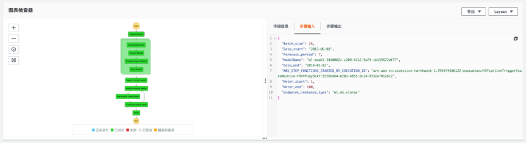

点选包含InitialTrainingStateMach-的状态机，在【定义】选项栏中设置需要调整的超参，然后点击【启动执行】

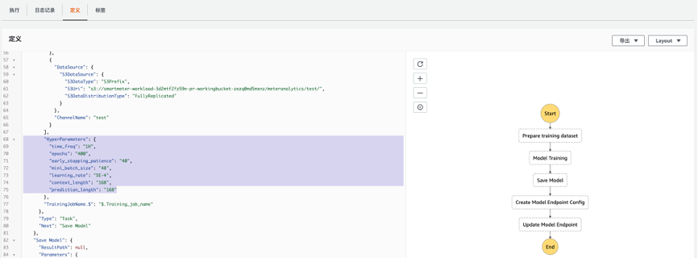

待工作流程执行完毕之后您可以重新跳转至SageMaker界面检查新生成的模型和服务节点。

### 调用API
基于AWS API Gateway，Lambda，Step Function构建的无服务架构将数据查询，汇聚，预测等能力通过RESTful API形式提供，您可以跳转至AWS API Gateway界面，点击【阶段】获取到API调用的URL信息

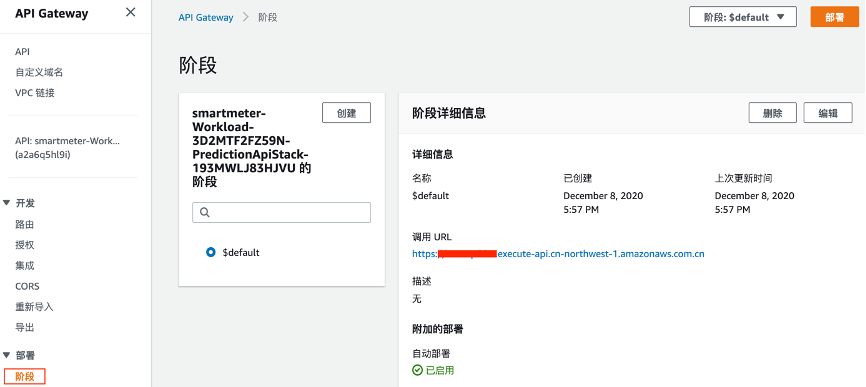

目前API提供的功能包括：
- 获取指定时间范围内所有或指定智能电表的异常数据，调用形式，参数描述以及对应的URL格式和返回内容如下：

| 调用参数  | 参数描述  |
| ------------ | ------------ |
| meter_id  | 智能电表id  |
| data_start  | 异常检测开始时间  |
| data_end  | 异常检测结束时间  |
| outlier_only  | 显示所有的智能电表数据（outlier_only=0）仅显示存在异常用量的智能电表数据（outlier_only=1）  |

URL格式
```
GET https://xxxxxxxx.execute-api.cn-northwest-1.amazonaws.com/anomaly/<meter_id>?data_start=<>&data_end=<>&outlier_only=<>
```

返回内容
```json
{
   "meter_id":{
      "1":"MAC000005",
      "2":"MAC000005"
   },
   "ds":{
      "1":"2013-01-02",
      "2":"2013-01-07"
   },
   "consumption":{
      "1":5.7,
      "2":11.436
   },
   "yhat_lower":{
      "1":3.3661955822,
      "2":3.5661772085
   },
   "yhat_upper":{
      "1":9.1361769262,
      "2":8.9443160402
   },
   "anomaly":{
      "1":0,
      "2":1
   },
   "importance":{
      "1":0.0,
      "2":0.217880724
   }
}
```

- 获取指定智能电表的年度，月度或每天用电量：

| 调用参数  | 参数描述  |
| ------------ | ------------ |
| aggregation level  | 按照每天/周/月汇聚数据  |
| year  | 指定需要获取数据的年份  |
| meter_id  | 指定智能电表id  |

URL格式
```
GET https://xxxxxx.execute-api.cn-northwest-1.amazonaws.com/consumption/<daily|weekly|monthly>/<year>/<meter_id>
```

返回内容
```json
[
   [
      "MAC001595",
      "20130223",
      3.34
   ],
   [
      "MAC001595",
      "20130221",
      5.316
   ],
   [
      "MAC001595",
      "20130226",
      4.623
   ]
]
```

- 预测指定时间范围内所指定的智能电表的未来使用量

| 调用参数  | 参数描述  |
| ------------ | ------------ |
| meter_id  | 需要进行预测的智能电表  |
| data_start  | 预测所使用数据集的开始时间  |
| data_end  | 预测所使用数据集的结束时间  |
| ml_endpoint_name  | Sagemaker所创建的终端节点  |

URL格式
```
GET https://xxxxxxxx.execute-api.cn-northwest-1.amazonaws.com/forecast/<meter_id>?data_start=<>&data_end=<>
```

返回内容
```json
{
   "consumption":{
      "1380585600000":0.7684248686,
      "1380589200000":0.4294368029,
      "1380592800000":0.3510326743,
      "1380596400000":0.2964941561,
      "1380600000000":0.3064994216,
      "1380603600000":0.4563854337,
      "1380607200000":0.6386958361,
      "1380610800000":0.5963768363,
      "1380614400000":0.5587928891,
      "1380618000000":0.4409750104,
      "1380621600000":0.4719932675
   }
}
```

- 获取指定时间范围内所有异常状态的智能电表ID和位置

| 调用参数  | 参数描述  |
| ------------ | ------------ |
| start_date_time  | 指定需要查询开始时间  |
| end_date_time  | 指定需要查询的结束时间  |

URL格式
```
GET https://xxxxxxxx.execute-api.cn-northwest-1.amazonaws.com/outage?start_date_time=<>&end_date_time=<>
```

返回内容
```json
{
   "Items":[
      {
         "meter_id":"MAC000138",
         "reading_date_time":"2013-01-03 09:30:00.000",
         "date_str":"20130103",
         "lat":40.7177325,
         "long":-74.043845
      },
      {
         "meter_id":"MAC000139",
         "reading_date_time":"2013-01-03 10:00:00.000",
         "date_str":"20130103",
         "lat":40.7177325,
         "long":-74.043845
      }
  ]
}
```

## FAQ
1.	该方案部署展示的数据集来源是哪里，是真实数据吗？

智能电表采集数据：https://data.london.gov.uk/dataset/smartmeter-energy-use-data-in-london-households 

天气数据：https://www.kaggle.com/jeanmidev/smart-meters-in-london?select=weather_hourly_darksky.csv 

2.	该方案展示的数据集格式，如何同我们现有生产系统适配？

当前的初始数据集schema以及清洗后用作业务的schema见附录数据集格式。针对客户的生产系统适配，需要考虑：1）如果实际业务schema可以复用，则仅需修改AWS Glue中初始数据集ETL的相应流程，如果实际业务schema存在差异，则需要修改AWS Glue中ETL的所流程包括数据的partition和aggregation，以及API网关后端逻辑和SageMaker训练流程；2）如果客户的生产系统存在多数据格式，则需要在AWS Glue分别进行数据格式的ETL适配，推荐方式为固定后端业务数据的schema，保证前端不同数据格式进行ETL后都可复用该schema，从而最小化后端如API网关和SageMaker的适配工作，前端不同数据格式的适配工作可通过合作伙伴，联合开发等方式实现；3）上传到S3的数据格式目前支持JSON，CSV，Parquet，ORC，Avro和Grok

3.	该方案的费用如何？

该解决方案包括AWS Glue，SageMaker，RedShift，S3，Step Functions，Lambda，API Gateway，其中费用集中在Glue（用于数据ETL）和SageMaker（用于模型训练部署），其中Glue主要按照ETL任务使用的数据处理单元 (DPU) 数量向您收取小时费用（3.021小时/小时）SageMaker是主要是针对运行SageMaker实例收取的费用（1.898元/小时）

4.	该方案用来预测智能电表未来用量的算法是什么？

该方案采用DeepAR来实现基于智能电表历史读取数据，天气数据，地理位置等多维数据集来实现基于时间轴的智能电表未来用量预测。DeepAR 是一个自回归循环神经网络，使用递归神经网络(RNN)结合自回归(AR)来预测标量（一维）时间序列。针对应用中具有代表性单元的多个相似时间序列，DeepAR 会结合多个相似的时间序列，通过深度递归神经网络学习不同时间序列内部的关联特性，使用多元或多重的目标个数来提升整体的预测准确度。DeepAR 最后产生一个可选时间跨度的多步预测结果，单时间节点的预测为概率预测，默认输出P10，P50和P90三个值。

## 附录

### CloudFormation堆栈参数

AWS Redshift配置

| 参数名称  | 参数默认值  | 参数描述  |
| ------------ | ------------ | ------------ |
| Master user name (MasterUsername)  | 用户输入  | Amazon Redshift集群的主用户名。用户名必须小写，以字母开头，仅包含字母数字字符“ _”，“ +”，“。”，“ @”或“-”，并且少于128个字符。  |
| Master user password (MasterUserPassword)  | 用户输入  | Amazon Redshift集群的主用户密码。密码必须为8-64个字符，包含至少一个大写字母，至少一个小写字母和至少一个数字。它只能包含ASCII字符（ASCII代码33-126），除了'（单引号），“（双引号），/，\或@。  |
| Amazon Redshift cluster name (ClusterName)  | redshift-cluster-1  | Redshift集群名称  |
| Amazon Redshift database name (DBName)  | meter-data  | Redshift数据库名称  |
| Amazon Redshift port (RedshiftPort)  | 5439  | Redshift端口号  |


AWS VPC网络配置

| 参数名称  | 参数默认值  | 参数描述  |
| ------------ | ------------ | ------------ |
| Availability Zones (AvailabilityZones)  | 用户输入  | VPC中的子网要使用的可用区列表。根据AWS最佳实践，您必须提供两个区域。如果指定了第三个可用区参数，则还必须提供该区。  |
| VPC CIDR (VPCCIDR)  | 10.0.0.0/16  | VPC中的CIDR（无类别域间路由）  |
| Private subnet 1A CIDR (PrivateSubnet1ACIDR)  | 10.0.0.0/19  | 可用区1中的私有子网1A对应的CIDR （无类别域间路由）  |
| Private subnet 2A CIDR (PrivateSubnet2ACIDR)  | 10.0.32.0/19  | 可用区2中的私有子网2A对应的CIDR （无类别域间路由）  |
| Remote access CIDR block (RemoteAccessCIDR)  | 0.0.0.0/0  | 可访问Redshift 集群的CIDR（无类别域间路由）  |


AWS Glue配置

| 参数名称  | 参数默认值  | 参数描述  |
| ------------ | ------------ | ------------ |
| Transformer that reads the landing-zone data (LandingzoneTransformer)  | London  | 定义原始数据ETL的转换方式，该方案采用的公开数据集地址参见FAQ  |
| Create landing-zone bucket (CreateLandingZoneS3Bucket)  | Yes  | Yes，默认创建包含landingzone前缀的S3桶用作原始数据的存储；
No，自定义S3桶的名称用作原始数据存储  |
| Landing-zone S3 bucket (LandingZoneS3BucketName)  | 空字符  | 如果Create landing-zone bucket您填入的是No，在此处填入您自定义的S3桶名称，否则默认留空  |
| Number of meters (NoOfMeters)  | 1-50000  | 原始数据集包含的智能电表数量，用于为AWS Glue工作任务配置适当数量的DPU。默认值为1-50000，适用于样本数据集或评估目的。对于具有更大规模智能电表部署的生产部署，请选择“ 50001及更多”。  |

AWS S3配置

| 参数名称  | 参数默认值  | 参数描述  |
| ------------ | ------------ | ------------ |
| Quick Start S3 bucket name (QSS3BucketName)  | aws-cn-quickstart-cn-northwest-1  | 如果您希望将官方模版拷贝至自己定义的S3桶中，请在此指定对应的S3桶名称。注意此存储桶名称可以包含数字，小写字母，大写字母和连字符，但不能以连字符（-）开头或结尾。  |
| Quick Start S3 key prefix (QSS3KeyPrefix)  | quickstart-aws-utility-meter-data-analytics-platform-cn  | 如果您希望将官方模版拷贝至自己定义的S3桶中，请在此指定对应的S3桶前缀。该前缀可以包括数字，小写字母，大写字母，连字符（-）和正斜杠（/）。  |
| Quick Start S3 bucket Region (QSS3BucketRegion)  | 空字符  | 如果Create landing-zone bucket您填入的是No，在此处填入您自定义的S3桶名称，否则默认留空  |
| Number of meters (NoOfMeters)  | cn-northwest-1s  | 官方模版和自定义模版所在的区域，官方模版默认在宁夏区域（cn-northwest-1） |


### 数据集格式

原始数据集如下：
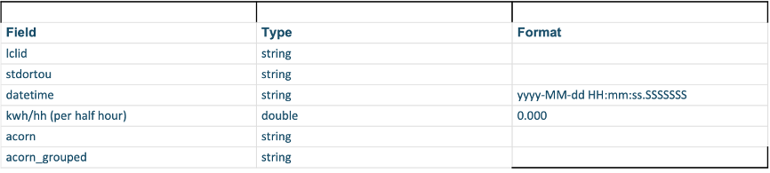

ETL后数据集格式如下：
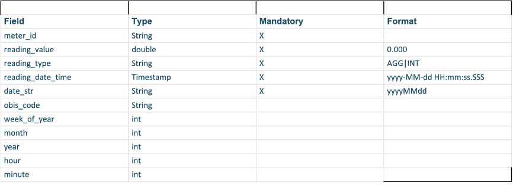

## 证书
This project is licensed under the Apache-2.0 License.

